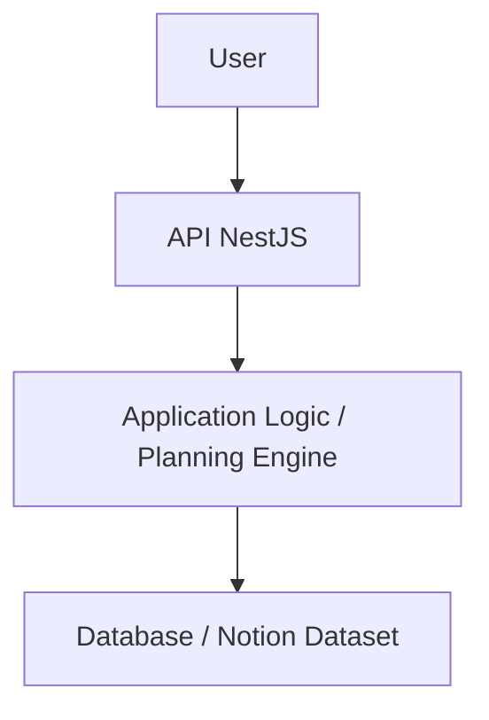
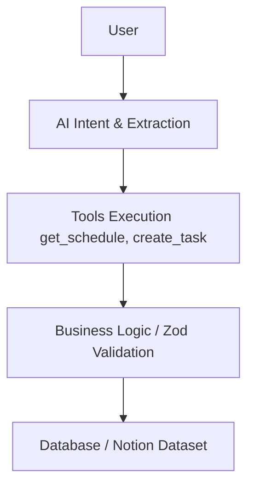

# Academic Brain - Arquitectura del Sistema

## 1. Problema
**¿Qué problema resuelve Academic Brain?**
Los estudiantes a menudo se enfrentan a la sobrecarga académica, la procrastinación y la dificultad para planificar su tiempo. Academic Brain resuelve el problema de la gestión del tiempo y la priorización traduciendo el caos de las instrucciones en lenguaje natural (ej. *"Tengo examen de historia el viernes y no he estudiado nada"*) en planes de estudio estructurados, priorizados y accionables. 

Su propuesta de valor principal es la **detección de sobrecarga** y el **cálculo determinista de prioridades**: la IA interpreta el problema, pero el motor de negocio calcula matemáticamente la urgencia y distribuye el tiempo disponible.

## 2. Usuario
**Inicialmente: 1 Usuario (Single-tenant)**
El MVP está diseñado como un sistema operativo personal ("StudyOS") para un único usuario. No contempla un diseño multiusuario complejo, autenticación de múltiples roles o segregación de datos avanzada en esta etapa. El objetivo es perfeccionar el modelo de dominio, la extracción de entidades y el motor de planificación antes de escalar horizontalmente.

## 3. Componentes

*   **Frontend:** React + TypeScript. Interfaz principal con un Dashboard (vista de carga académica, prioridades del día, resumen diario).
*   **Backend:** Node.js + NestJS. Expone una API REST modularizada (auth, academic, ai, planning, scheduler, notifications). Es el "cerebro" real y determinista de la aplicación.
*   **Database:** PostgreSQL (como base de datos principal para registrar eventos, logs y extracciones de IA) **integrado con un dataset estructurado en Notion** para el almacenamiento y tratamiento del modelo de datos base (Cursos, Tareas, Exámenes). Redis se utiliza para caché y manejo de colas.
*   **AI:** OpenAI API (Responses API / Structured Outputs). Se utiliza estrictamente como un motor de extracción de intenciones (NLP -> JSON validado con Zod) y razonamiento semántico, **no** como la base de datos ni el ejecutor de lógica de negocio.
*   **Scheduler:** BullMQ (respaldado por Redis) para encolar y ejecutar tareas programadas (resúmenes diarios, recordatorios pre-examen). Evolucionable a Temporal en el futuro.
*   **Notifications:** Telegram (MVP) para notificaciones rápidas e interacciones conversacionales, con miras a expandirse a Web Push y Email en fases posteriores.

## 4. Flujo Principal (Actual/Base)
Este es el flujo determinista para la gestión de datos mediante la API y la lógica de negocio estructurada:

## 5. Flujo Futuro (Agente Autónomo)
Este flujo representa la fase avanzada donde el usuario interactúa en lenguaje natural, y el agente orquesta el uso de herramientas antes de impactar el sistema:

